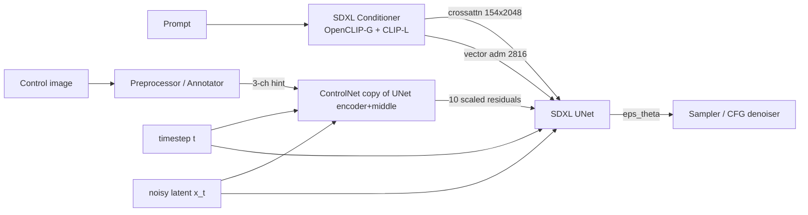
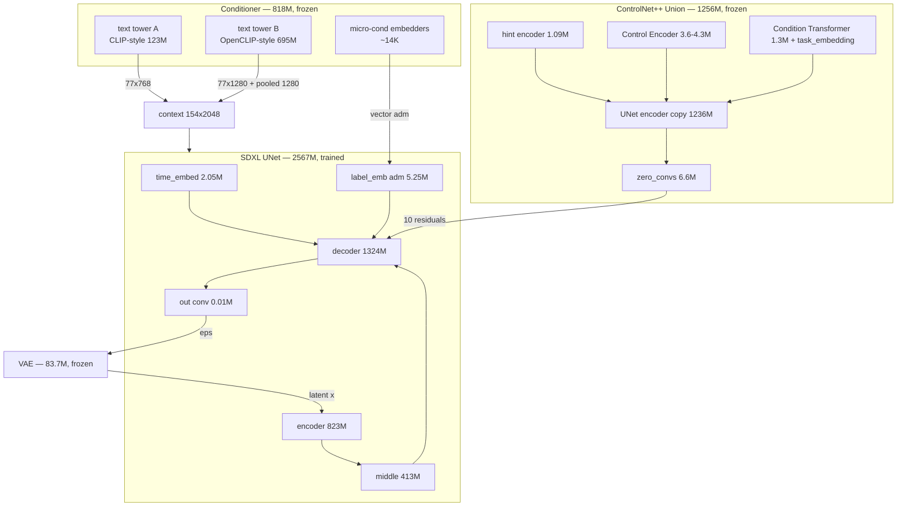
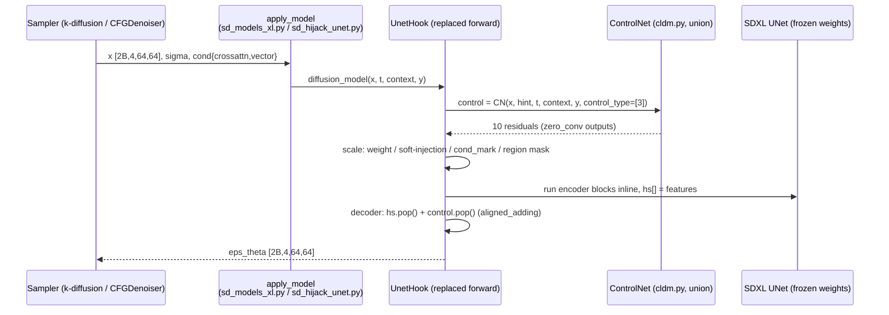

# How ControlNet cooperates with SDXL — Technical Deep-Dive

> Companion to `CONTROLNET_UNION_SDXL_GUIDE.md`. All code references below point at the actual files
> in this repository (A1111 v1.10.1 fork + `sd-webui-controlnet` v1.1.454 + `repositories/generative-models`).
> Written 2026-09-07.

---

## 1. The big picture

SDXL's UNet turns **noisy latents + text + timestep** into denoised latents. ControlNet never touches the
sampler, the text encoders, or the VAE — it is a **trainable side-network whose outputs are added into the
UNet's decoder as residuals**. The UNet stays frozen; only the side-network learns. For ControlNet++ Union,
one extra "control type id" signal lets a *single* side-network serve 12 different conditions.



---

## 2. SDXL UNet as ControlNet sees it (this fork)

Model lives in `repositories/generative-models/sgm/modules/diffusionmodules/openaimodel.py::UNetModel`.

**Conditioning inputs** (`modules/sd_models_xl.py::get_learned_conditioning` builds them; the fork's
`apply_model` routes them each denoising step):

| Signal | Shape | Path into UNet |
|---|---|---|
| `x` | `[2B, 4, H/8, W/8]` | noisy latents; `2B` because CFG concatenates cond + uncond |
| `context` (`crossattn`) | `[2B, 154, 2048]` | SDXL concatenates the two text encoders' 77-token outputs (154 tokens); consumed by every cross-attention |
| `y` (`vector`) | `[2B, 2816]` | original size, crop coords, target size + pooled text embedding (1280); `emb = t_emb + label_emb(y)` |
| `timesteps` | `[2B]` | sinusoidal `timestep_embedding` → `time_embed` MLP → `t_emb` |

The SDXL UNet has **3 down-blocks (9 sub-levels) + 1 middle block**, so its encoder emits
**9 skip features + 1 middle feature = 10 injection slots** (SD 1.5 has 12+1 = 13 — the extension knows
both: `total_controlnet_embedding = [0.0] * 10 if is_sdxl else [0.0] * 13`).

```python
# openaimodel.py — the decoder consumes encoder skip features
for module in self.output_blocks:
    h = th.cat([h, hs.pop()], dim=1)   # <-- ControlNet residuals are added to hs[i]
    h = module(h, emb, context)
```

## 3. The complete network inventory — every module and its parameter budget

Everything in the graph, what its parameters are for, and **exact counts parsed from the actual
files in this repo** (`novaAnimeXL_ilV180.safetensors` for SDXL, `controlnet_union_sdxl_*.safetensors`
for the union ControlNet).

### 3.1 The SDXL graph (measured)

| Component | Params | Trained? | What the parameters do |
|---|---|---|---|
| Text tower A — CLIP-style, 12 layers (`conditioner.embedders.0`) | 123.06 M | frozen | token + position embeddings, 12 self-attn/MLP transformer layers → 77×768 token embeddings |
| Text tower B — OpenCLIP-style, `ln_final` 1280 (`conditioner.embedders.1`) | 694.66 M | frozen | second text encoder; 77×1280 tokens **and** the 1280-d `text_projection` pooled embedding (feeds the adm) |
| Micro-conditioning embedders | ~14 K (3× Linear(2→256)) | trainable (see caveat) | `ConcatTimestepEmbedderND`: original-size, crop-coords, target-size each projected 2→256 and concatenated into `vector` |
| UNet — input blocks (encoder) | 822.95 M | trained | downsample latents 4→320 ch, build the skip-feature pyramid (this is what the ControlNet copies) |
| UNet — middle block | 413.12 M | trained | deepest feature refinement (the other half of the ControlNet copy) |
| UNet — output blocks (decoder) | 1324.08 M | trained | upsample, concatenating skip features — **where ControlNet residuals are added** |
| UNet — `time_embed` MLP | 2.05 M | trained | sinusoidal t (320) → SiLU MLP → 1280-d `t_emb` |
| UNet — `label_emb` (adm embedder) | 5.25 M | trained | the 2816-d `y` vector → 1280, added to `t_emb` |
| UNet — final `out` conv | 0.01 M | trained | 1280 → 4 channels, the predicted noise `eps_theta` |
| VAE (encoder + decoder, `double_z`, 4 latent ch) | 83.65 M | frozen | 3-ch pixel ↔ 4-ch latent at 8× compression; used once before and once after sampling |
| **UNet total** | **2567.46 M** | | |

Context assembly: tower A's 77 tokens and tower B's 77 tokens are concatenated along the sequence
axis → **`crossattn` context `[2B, 154, 2048]`** consumed by every attention layer. The pooled 1280-d
text embedding + size/crop/target micro-conditioning form the **`vector` / `y` `[2B, 2816]`**, consumed
once per step by `label_emb`. (`modules/sd_models_xl.py::get_learned_conditioning` builds the dict;
`apply_model` feeds `crossattn`→`context` and `vector`→`y` each denoising step.)

> **Caveat found while measuring**: this anime checkpoint stores **only the two text towers** — the
> micro-conditioning embedder weights are absent from the file, so they are randomly re-initialized at
> every load. Their contribution is tiny (three 2→256 linears) but it means size/crop/target conditioning
> in `vector` is untrained random projection for this checkpoint, not a tuned signal.

### 3.2 What is *not* parameters

These are part of the pipeline but contribute no weights: the k-diffusion sampler schedule (sigma
arithmetic), the CFG denoiser (`cond`/`uncond` concatenation and scale), the attention kernel choice
(SDPA/xformers), the ControlNet hook itself (`hook.py` — pure code around the frozen UNet), and LoRA
adapters (learned *deltas* applied on top of UNet/text-tower weights, not stored in the checkpoint).

### 3.3 What ControlNet adds to the network (measured from the union file)

| Component | Standard (6-type) | ProMax (8-type) | Purpose |
|---|---|---|---|
| Copied UNet encoder blocks | 822.94 M | 822.94 M | the side-net's encoder; consumes `x` + `hint` + `emb` |
| Copied UNet middle block | 413.12 M | 413.12 M | side-net middle; second residual source |
| `time_embed` MLP | 2.05 M | 2.05 M | its own copy of the timestep path |
| SDXL-style `add_embedding` | 5.25 M | 5.25 M | mirrors the UNet's adm conditioning (`text_time` type) so the side-net sees the same `y`-derived signal as the UNet |
| `conv_in` (4→320) | 0.01 M | 0.01 M | latent input projection |
| Hint encoder (`controlnet_cond_embedding`) | 1.09 M | 1.09 M | the 3→320 conv ladder for the control map |
| `zero_convs` (down) + middle zero-conv | 4.92 M + 1.64 M | same | the 10 learned residual gates, zero-initialized at training start |
| **Union: Control Encoder** (`control_type_proj` + `control_add_embedding`) | 3.61 M | 4.26 M | one-hot type id → timestep-embedding → added to `emb` |
| **Union: Condition Transformer** (`transformer_layes` + `spatial_ch_projs`) | 1.34 M | 1.34 M | attention over condition tokens; per-channel bias on hint features |
| **Union: `task_embedding`** | 6×320 = 1,920 | 8×320 = 2,560 | the learned per-type tokens — <0.001% of the model, yet it switches all 12 behaviors |
| **TOTAL** | **≈1,256 M** | **≈1,257 M** | ≈ half an SDXL UNet |

Two things stand out:
1. The ControlNet copies **neither the VAE nor the text towers** — it borrows `context` and `y` from the
   UNet call at no extra cost.
2. The entire union machinery is ~5–9 M params on top of a vanilla SDXL ControlNet — the
   "one model, 12 conditions" capability costs well under 1% of the side-net's size.

Per denoising step the working graph is therefore SDXL UNet (2.57B, frozen) + union ControlNet
(1.26B, frozen) ≈ 3.8B params — both pure inference.



## 4. What ControlNet is, structurally

`extensions/sd-webui-controlnet/scripts/cldm.py::ControlNet`:

1. **A copy of the UNet's encoder + middle block** (`input_blocks`, `middle_block`). Same weights at
   initialization, but *trained independently* — SDXL is frozen during ControlNet training.
2. **`input_hint_block`** — a small conv stack that squeezes the 3-channel hint (edge/depth/pose map) into
   the UNet's feature space: `3 → 16 → 16 → 32 → 32 → 96 → 96 → 256 → model_channels(320)`.
3. **`zero_convs`** — one `1×1 conv` after every encoder level and after the middle block,
   **initialized to zero** (`zero_module` in `cldm.py`). This is the guarantee that at step 0 of training the
   side-network adds exactly `0` and SDXL behaves unchanged — training then gradually "grows" the signal.

Forward (per denoising step):

```python
# cldm.py::ControlNet.forward  (simplified)
t_emb = timestep_embedding(timesteps, model_channels)
emb   = self.time_embed(t_emb)                      # same as the UNet's time path
emb  += self.control_add_embedding(control_type, …) # <-- UNION ONLY: per-type embedding
guided_hint = self.input_hint_block(hint, emb, context)   # encode the control map

h = x
for module, zero_conv in zip(self.input_blocks, self.zero_convs):
    h  = module(h, emb, context)
    h += guided_hint                                 # condition fused into first encoder level
    guided_hint = None
    outs.append(zero_conv(h, emb, context))          # one residual per encoder level
h = self.middle_block(h, emb, context)
outs.append(self.middle_block_out(h, emb, context))  # + middle = 10 residuals for SDXL
```

Because the copy mirrors SDXL's encoder, it produces residuals that are **spatially and semantically
aligned** with the UNet's skip features.

## 5. The handshake: how residuals enter the UNet

The extension never edits the frozen UNet's weights. It **replaces `diffusion_model.forward` with a
wrapper** (`extensions/sd-webui-controlnet/scripts/hook.py::UnetHook`). Each denoising step the wrapper:

1. Runs each enabled ControlNet unit:
   `control = param.control_model(x, hint, timesteps, context, y, control_type=[…])` → 10 residuals.
2. Scales them: `c * weight` (per-unit Control Weight), optionally a decaying schedule for
   "My prompt is more important" (`0.825 ** (12 - i)` soft injection), optionally per-level
   **advanced weighting**, optionally an effective-region mask.
3. Adds them to the matching skip connections while re-running the UNet pass:

```python
# hook.py — U-Net Decoder (abridged from the installed v1.1.454)
for i, module in enumerate(self.output_blocks):
    h = th.cat([h, aligned_adding(hs.pop(), total_controlnet_embedding.pop(), …)], dim=1)
    h = module(h, emb, context)
```

`aligned_adding(hs_i, control_i)` = `hs_i + control_i` (with channel padding / nearest resize if sizes
mismatch). I.e. **`skip_i = skip_i + w_i · control_i`** — a pure residual injection, exactly what the
original ControlNet paper defines.

### CFG interaction — where "Control Mode" lives

`x` and `context` carry both CFG branches (`2B`). Three behaviors:

| Control Mode | Injection | Effective strength |
|---|---|---|
| Balanced | both cond & uncond sides | `weight` |
| My prompt is more important | both sides, `0.825^i` decay per level | `weight × 0.825^i` |
| ControlNet is more important (`cfg_injection`) | cond side only (`control * cond_mark`) | ~`weight × CFG scale` |

Guidance start/end (`guidance_stopped`) simply skips injection outside the chosen step fraction.
Hires. Fix runs two passes with different resolutions — the hook holds two hints and picks the one matching
the current latent shape (canny/MLSD get forced soft injection on the high-res pass to avoid artifacts).

## 6. What ControlNet++ Union adds on top

One ControlNet, 12 conditions. Two small modules on the same backbone (union model file: 1B params,
same size as a plain SDXL ControlNet — full ledger in §3.3):

### 6.1 Control Encoder — telling the network *which* condition

`scripts/controlnet_core/controlnet_union.py` (`ControlAddEmbedding`) + `cldm.py`:

```python
emb += self.control_add_embedding(control_type, emb.dtype, emb.device)
```

The one-hot control-type vector is expanded with `timestep_embedding` and a 2-layer MLP
(`linear_1: in_dim×num_types → out_dim`) produces a **per-type embedding added to the time embedding** —
so every block of the copied encoder "knows" which condition it is processing.

### 6.2 Condition Transformer — fusing one or many conditions

`cldm.py::union_controlnet_merge` (v1.1.454) implements the equivalent of the official
`Condition Transformer`:

```python
controlnet_cond = self.input_hint_block(hint[idx], emb, context)
feat_seq = torch.mean(controlnet_cond, dim=(2, 3))          # N×C global feature
feat_seq += self.task_embedding[control_type[idx]]           # learned per-type token
x = self.transformer_layes(x)                                # self-attn over condition tokens
alpha = self.spatial_ch_projs(x[:, idx])                     # N×C
condition_list[idx] += alpha[..., None, None]                # per-channel bias on the hint features
```

- `task_embedding`: `[num_control_type, 320]` learned vectors — **6 rows in the standard model,
  8 in ProMax** (tile, repaint). This is how the extension auto-detects a union model and its type count.
- The transformer lets conditions *modulate each other* — that is the learned fusion. In the official
  pipeline several hints pass in one forward; in this extension version each unit runs one condition
  (upstream TODO: merge units sharing a union model into one fused pass).

### Type-id → condition table (see the guide for preprocessor names)

| id | 0 | 1 | 2 | 3 | 4 | 5 | 6 | 7 |
|---|---|---|---|---|---|---|---|---|
| type | OpenPose | Depth | Soft Edge | Hard Edge | Normal | Segmentation | Tile | Repaint |
| model | ✓ | ✓ | ✓ | ✓ | ✓ | ✓ | promax | promax |

## 7. End-to-end flow, one denoising step



Per unit the step cost ≈ one extra SDXL **encoder + middle** pass (the most expensive part of the UNet),
so one ControlNet typically adds roughly +50–70% per-step time. Hints are preprocessed **once per image**
(annotator run + normalization `y/255`), then reused for every step.

## 8. Where things can go wrong (observed in this install)

- **4-channel hints**: this extension builds union nets with `hint_channels = input_hint_block.0.weight.shape[1] = 3`.
  A1111's inpaint preprocessors emit RGBA (image+mask) → shape mismatch. That is why the ProMax fused
  repaint mode (id 7) can't be driven from the UI here; the model itself supports it via the diffusers
  `StableDiffusionXLControlNetUnionInpaintPipeline` (present in this venv's diffusers 0.32.2).
- **"Control Type = All"**: the union type id is derived from the Control Type filter; "All" → *Unknown* →
  `ValueError: Unknown control type cannot be encoded`.
- **Type ids out of range**: tile(6)/repaint(7) with the 6-type standard weights → index error.
- **Key conversion**: the union safetensors use diffusers key names (`controlnet_cond_embedding.*`);
  `controlnet_model_guess.py` converts them (`convert_from_diffuser_state_dict`) and renames
  `attn.in_proj_` → `attn.in_proj.` before the union branch loads.
- **Model compatibility**: the copied encoder must match the checkpoint's SDXL UNet config
  (`block_out_channels [320,640,1280]`, `cross_attention_dim 2048`, `transformer_layers_per_block [1,2,10]`)
  — pairing the union model with a non-SDXL checkpoint fails hard.

## 9. Why the design is efficient

- **Zero-conv + frozen base** = training never destabilizes the pretrained model; no distillation needed.
- **Encoder copy ≈ 1B params** for SDXL (the union card confirms ≈ same count as a vanilla SDXL ControlNet) —
  the two union modules (8×320 task embedding + one transformer layer + small linears) are negligible.
- **Condition fusion for free**: multiple conditions share the one encoder and are summed after the
  transformer, so multi-condition does not multiply compute (official pipeline; stacking units in the
  extension is the fallback).

## 10. References in this repo

- `extensions/sd-webui-controlnet/scripts/hook.py` — `UnetHook`, per-step injection, CFG modes, hires fix.
- `extensions/sd-webui-controlnet/scripts/cldm.py` — `ControlNet` (ldm-style), `union_controlnet_merge`.
- `extensions/sd-webui-controlnet/scripts/controlnet_core/controlnet_union.py` — `ControlAddEmbedding`, `ResBlockUnionControlnet`.
- `extensions/sd-webui-controlnet/scripts/controlnet_model_guess.py` — union auto-detection & key conversion.
- `repositories/generative-models/sgm/modules/diffusionmodules/openaimodel.py` — `UNetModel.forward`.
- `modules/sd_models_xl.py`, `modules/sd_hijack_unet.py` — cond routing (`crossattn`/`vector`) per step.
- Model & architecture: <https://github.com/xinsir6/ControlNetPlus> · <https://huggingface.co/xinsir/controlnet-union-sdxl-1.0>
